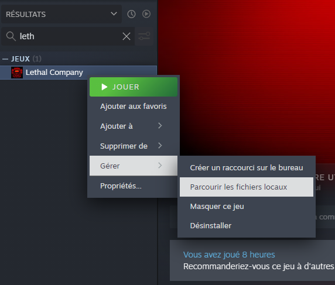
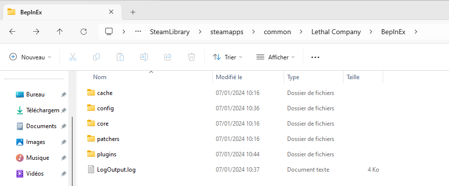

# Documentation d'Installation de Mods pour "Lethal Company" sur Steam

## BepInEx

### Téléchargement de BepInEx

Téléchargez la dernière version de BepInEx depuis le lien suivant : [BepInEx v5.4.22.0](https://github.com/BepInEx/BepInEx/releases/download/v5.4.22/BepInEx_x64_5.4.22.0.zip)

### Localisation du dossier du jeu sur Steam

1. Ouvrez Steam.
2. Accédez à la bibliothèque de jeux.
3. Cliquez avec le bouton droit sur "Lethal Company" et sélectionnez "Propriétés".
4. Dans l'onglet "Fichiers locaux", cliquez sur "Parcourir les fichiers locaux".

### Vérification de l'installation

Assurez-vous que les dossiers tels que `config`, `core`, `patchers` et `plugins` se trouvent dans le dossier `BepInEx` une fois avoir lancer le jeu.

## Installation des Mods

Téléchargez le ou les fichiers zip contenant [les mods](./Mods.md).

### Extraction des Mods dans le dossier "plugins" de BepInEx

Les fichiers des mods doivent être placés dans les sous-dossiers appropriés de `BepInEx` (exemple: plugins).

1. Lancez le jeu.
2. Démarrez une partie en solo pour tester les mods installés.
3. Vérifiez que les mods fonctionnent correctement.